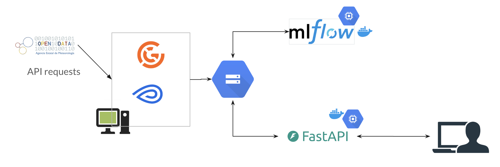
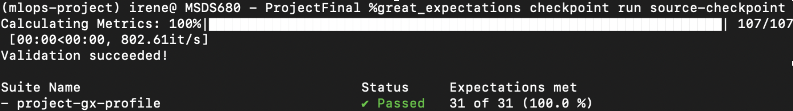
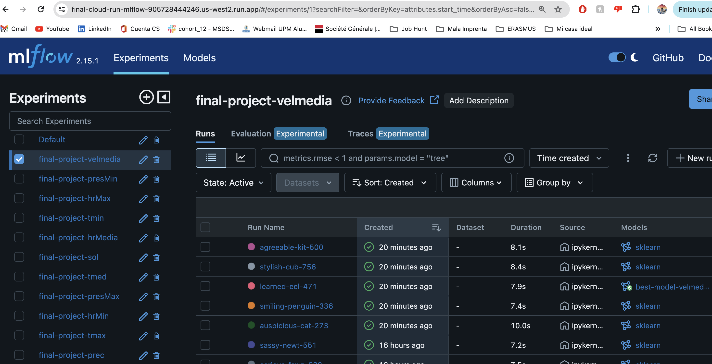
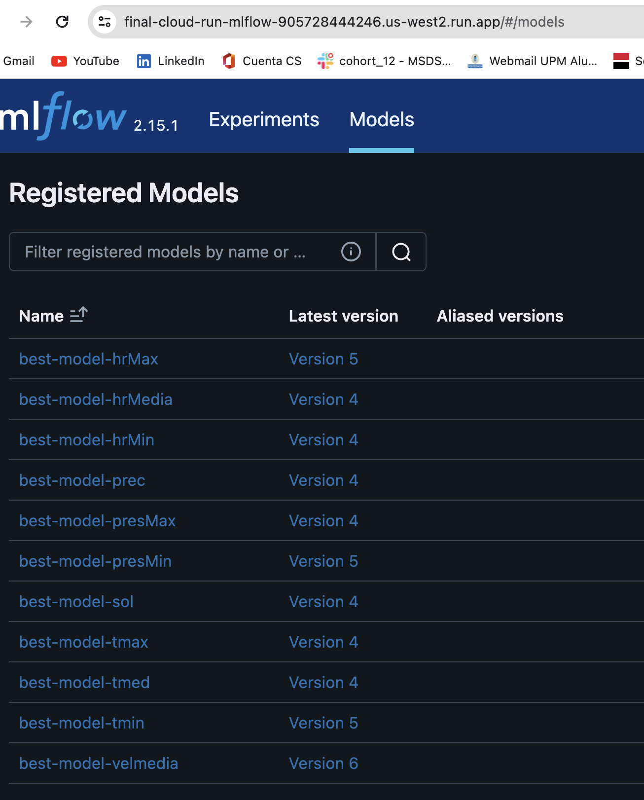
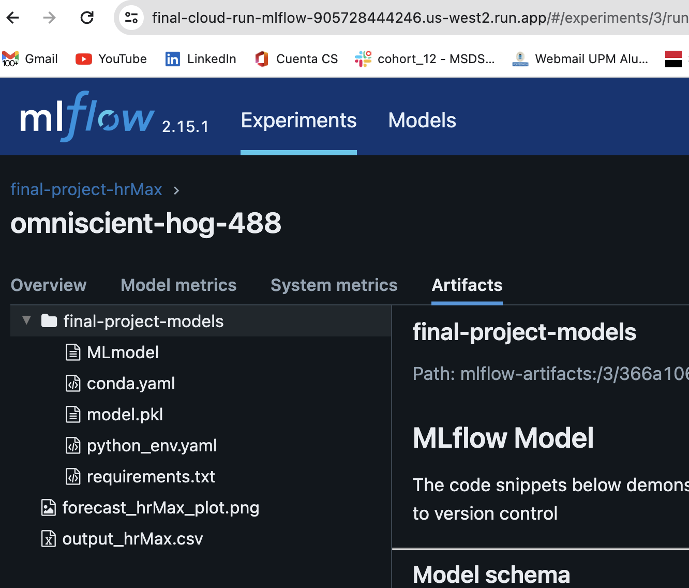

# End-to-End ML OPS project for Weather prediction
Repo for the MSDS MLOps course

The purpose of this project is feed a simple Prohpet model the last twenty year on weather data in the city of Alicante (Spain), train it in a Metaflow flow and choose the best model parameters using MLflow. The best model for each weather variable will be accessible to a FastAPI app so users can ask what will be the weather prediction for a variable in the future.

### The Architecture 

This basic graph summarizes the framework and tools used in this project:

### Great Expectations

When the data is pulled from the API that is sourced from, it is processed in the Metaflow job for it a uploaded to the Google Cloud Bucket. Before that, it need to be ckecked by Great Expectations to see that it passes all of our requirements.

There are 31 test in total that the data needs to pass with a 100% success rate:

### ML Flow

When the data is ready, the Metaflow training job starts. It is connected to a running container in GCP with MLFlow running.

Experiments are done on each of the weather variables and the best model for each is registered:

Each model is recorded along with a collection of artifacts, including a plo png of the data + predictions, a model pickle file and the csv data file the model was trained on.

